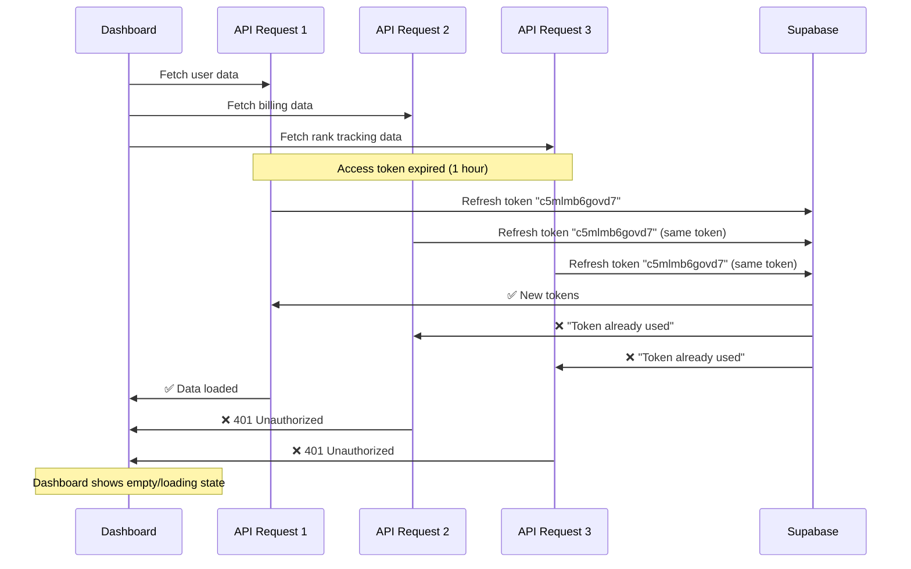

# Refresh Token Race Condition Issue - Analysis & Fix Guide

## Problem Description

**Symptom:** User is logged in but the dashboard appears empty with no data, while network requests show `POST https://base.indexnow.studio/auth/v1/token?grant_type=refresh_token` returning "refresh token already being used" errors.

**Root Cause:** Multiple concurrent API requests attempt to refresh the same access token simultaneously, causing a race condition where only the first request succeeds in using the single-use refresh token, leaving subsequent requests with invalid authentication.

## The Problem Flow



## Core Issues Identified

### 1. **No Refresh Token Concurrency Control**
- **File:** `app/api/v1/auth/session/route.ts`
- **Issue:** Multiple requests can simultaneously attempt to use the same refresh token
- **Current Code:** No error handling for "refresh token already used" scenarios

### 2. **Missing Authentication Recovery Logic**
- **File:** `hooks/useDashboardData.ts`
- **Issue:** When auth fails, the hook throws an error with no recovery mechanism
- **Current Code:** Immediately fails on missing access token

### 3. **No Session Operation Synchronization**
- **File:** `lib/auth/auth.ts`
- **Issue:** Concurrent authentication operations aren't coordinated
- **Current Code:** Multiple calls to session endpoint can happen simultaneously

### 4. **Insufficient Global Error Handling**
- **File:** `lib/core/queryClient.ts`
- **Issue:** No auth-specific retry logic or 401 interceptor
- **Current Code:** Generic retry (1 attempt) with no auth context

### 5. **Race Condition Triggers**
- Dashboard page load with multiple `useQuery` hooks
- Navigation between pages while requests are pending
- WebSocket connections authenticating concurrently with HTTP requests
- Background token refresh overlapping with user-triggered requests

## Technical Root Causes

### **Supabase Security Behavior**
- Refresh tokens are **single-use only** (security best practice)
- Each successful refresh invalidates the previous token
- No built-in concurrency protection

### **Application Architecture Issues**
- No request queuing or serialization
- No session state coordination between components  
- No graceful auth failure recovery
- Missing refresh token retry mechanisms

## Step-by-Step Fix Implementation

### **Phase 1: Critical Session Management (MUST FIX FIRST)**

#### **Step 1.1: Fix Session Endpoint**
**File:** `app/api/v1/auth/session/route.ts`

**Current Issue:** Lines 75-83 don't handle refresh token errors
```typescript
const { data, error } = await supabase.auth.setSession({
  access_token,
  refresh_token
})

if (error) {
  logger.error({ error: error.message }, 'Failed to set session')
  return NextResponse.json({ error: error.message }, { status: 400 })
}
```

**Implementation Requirements:**
1. **Detect "refresh token already used" errors**
   - Check error message patterns from Supabase
   - Identify concurrent request scenarios

2. **Implement retry mechanism with fresh session**
   - Attempt to fetch current valid session
   - Retry setSession with fresh tokens if available
   - Maximum 2 retry attempts to prevent infinite loops

3. **Add request deduplication**
   - Track pending session refresh operations by user ID
   - Queue concurrent requests instead of failing them
   - Return cached result if refresh recently succeeded

#### **Step 1.2: Add Authentication Service Coordination**
**File:** `lib/auth/auth.ts`

**Current Issue:** Lines 158-177 allow concurrent session calls
```typescript
if (data.session) {
  await fetch(AUTH_ENDPOINTS.SESSION, {
    method: 'POST',
    body: JSON.stringify({
      access_token: data.session.access_token,
      refresh_token: data.session.refresh_token
    }),
  })
}
```

**Implementation Requirements:**
1. **Implement async mutex for session operations**
   - Create a per-user session lock mechanism
   - Serialize all authentication state changes
   - Prevent concurrent session modifications

2. **Add session refresh queue**
   - Queue pending authentication requests during refresh
   - Process queued requests with fresh tokens
   - Clear queue on successful refresh

3. **Cache valid sessions temporarily**
   - Store successful session results for 30 seconds
   - Return cached tokens for concurrent requests
   - Prevent redundant API calls

### **Phase 2: Data Fetching Recovery (HIGH PRIORITY)**

#### **Step 2.1: Enhance Dashboard Data Hook**
**File:** `hooks/useDashboardData.ts`

**Current Issue:** Lines 28-32 fail immediately on auth error
```typescript
const { data: { session } } = await supabase.auth.getSession()

if (!session?.access_token) {
  throw new Error('No access token available')
}
```

**Implementation Requirements:**
1. **Add 401 error recovery**
   - Detect authentication failures in API responses
   - Attempt session refresh on 401 errors
   - Retry original request with fresh token

2. **Implement progressive retry logic**
   - First attempt: Use cached session
   - Second attempt: Force session refresh
   - Third attempt: Clear all auth state and redirect to login

3. **Add graceful fallback states**
   - Show "Refreshing session..." instead of empty dashboard
   - Provide manual refresh button on persistent failures
   - Log detailed error information for debugging

#### **Step 2.2: Update Query Configuration**
**File:** `lib/core/queryClient.ts`

**Current Issue:** Lines 11-12 have generic retry without auth context
```typescript
retry: 1,
```

**Implementation Requirements:**
1. **Create auth-aware retry function**
   - Detect 401/authentication errors specifically
   - Different retry logic for auth vs. network errors
   - Maximum 3 retries for auth errors, 1 for others

2. **Implement global 401 interceptor**
   - Intercept all 401 responses across the application
   - Trigger automatic session refresh
   - Retry original request transparently

3. **Add session refresh automation**
   - Proactive token refresh before expiration
   - Background session validation
   - Automatic recovery on auth state changes

### **Phase 3: Application-Wide Coordination (MEDIUM PRIORITY)**

#### **Step 3.1: Enhance Auth Context**
**File:** `lib/contexts/AuthContext.tsx`

**Implementation Requirements:**
1. **Add authentication state coordination**
   - Track session refresh status globally
   - Coordinate between multiple components
   - Prevent duplicate authentication attempts

2. **Implement session health monitoring**
   - Periodic token validation
   - Early warning for token expiration
   - Automatic background refresh

#### **Step 3.2: Update API Middleware**
**File:** `lib/core/api-middleware.ts`

**Implementation Requirements:**
1. **Standardize auth error responses**
   - Consistent error format across all endpoints
   - Include retry-after headers where appropriate
   - Proper HTTP status codes

2. **Add authentication debugging**
   - Log detailed auth failure information
   - Track token refresh patterns
   - Monitor concurrent request patterns

### **Phase 4: Testing & Monitoring (ESSENTIAL)**

#### **Step 4.1: Create Test Scenarios**
1. **Race condition simulation**
   - Concurrent dashboard loads
   - Multiple tab authentication
   - Background task interference

2. **Error recovery testing**
   - Network interruption during refresh
   - Invalid token scenarios
   - Session expiration edge cases

#### **Step 4.2: Add Monitoring**
1. **Authentication metrics**
   - Track refresh token failures
   - Monitor session recovery success rates
   - Alert on authentication anomalies

2. **User experience monitoring**
   - Dashboard load success rates
   - Authentication error frequencies
   - Recovery mechanism effectiveness

## Implementation Priority

### **CRITICAL (Fix Immediately):**
1. `app/api/v1/auth/session/route.ts` - Session endpoint race condition
2. `lib/auth/auth.ts` - Authentication service mutex

### **HIGH PRIORITY (Next Sprint):**
3. `hooks/useDashboardData.ts` - Dashboard recovery mechanism
4. `lib/core/queryClient.ts` - Global auth error handling

### **MEDIUM PRIORITY (Following Sprint):**
5. `lib/contexts/AuthContext.tsx` - Auth state coordination
6. API middleware standardization

## Success Metrics

### **Technical Metrics:**
- Zero "refresh token already used" errors
- 100% dashboard data load success rate after login
- < 2 second recovery time from auth failures
- Zero manual login redirects due to race conditions

### **User Experience Metrics:**
- Seamless navigation between dashboard sections
- No empty dashboard states for authenticated users
- Transparent authentication refresh
- Consistent cross-subdomain authentication

## Risk Mitigation

### **Potential Issues:**
1. **Performance impact** from synchronization overhead
2. **Increased complexity** in authentication flow
3. **Edge cases** in concurrent scenarios

### **Mitigation Strategies:**
1. **Performance monitoring** during implementation
2. **Gradual rollout** with feature flags
3. **Comprehensive testing** of edge cases
4. **Fallback mechanisms** for critical failures

---

**Document Version:** 1.0  
**Created:** September 25, 2025  
**Last Updated:** September 25, 2025  
**Status:** Ready for Implementation